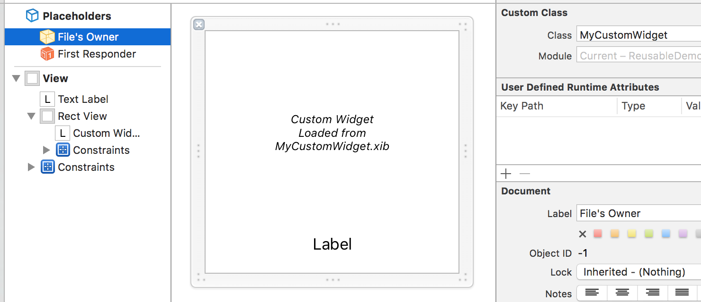
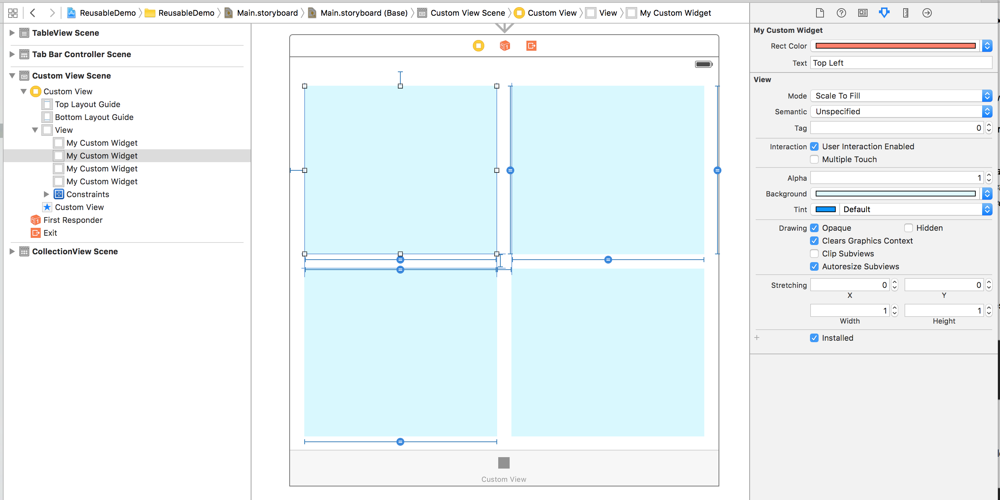

# Reusable

<p align="center">
  
</p>

A Swift mixin to use `UITableViewCells`, `UICollectionViewCells` and `UIViewControllers` in a **type-safe way**, without the need to manipulate their `String`-typed `reuseIdentifiers`. This library also supports arbitrary `UIView` to be loaded via a XIB using a simple call to `loadFromNib()`

[](http://cocoadocs.org/docsets/Reusable)
[](http://cocoadocs.org/docsets/Reusable)
[](https://swift.org)

# Requirements

|  Swift Version |  Reusable Version  |
|----------------|--------------------|
|    2.2 & 2.3   |        2.5.1       |
|       3.0      |        3.0.0 +     |

# Introduction

This library aims to make it super-easy to create, dequeue and instantiate reusable views anywhere this pattern is used: from the obvious `UITableViewCell` and `UICollectionViewCell` to custom `UIViews`, even supporting `UIViewControllers` from Storyboards.  
All of that simply by **marking your classes as conforming to a protocol, without having to add any code**, and **creating a type-safe API with no more String-based API**.

```swift
// Example of what Reusable allows you to do
final class MyCustomCell: UITableViewCell, Reusable { /* And that's it! */ }
tableView.register(MyCustomCell)
let cell: MyCustomCell = tableView.dequeueReusableCell(indexPath: indexPath)
```

This concept, called a [Mixin](http://alisoftware.github.io/swift/protocol/2015/11/08/mixins-over-inheritance/) (a protocol with default implementation for all its methods), is explained [here in my blog post](http://alisoftware.github.io/swift/generics/2016/01/06/generic-tableviewcells/) in details.

**Table of Contents**

* [Type-safe cells](#type-safe-uitableviewcell--uicollectionviewcell)
* [Type-safe XIB-based reusable views](#type-safe-xib-based-reusable-views)
* [Type-safe ViewControllers from Storyboards](#type-safe-viewcontrollers-from-storyboards)
* [Additional tips](#additional-tips)
* [Example project](#example-project)
* [License](#license)


---


# Type-safe `UITableViewCell` / `UICollectionViewCell`

> ✍️ Examples and explanations below use `UITableView` and `UITableViewCell`, but the exact same examples and explanations apply for `UICollectionView` and `UICollectionViewCell`.

## 1. Declare your cells to conform to `Reusable` or `NibReusable`

* Use the `Reusable` protocol if they don't depend on a NIB (this will use `registerClass(…)` to register the cell)
* Use the `NibReusable` typealias (= `Reusable & NibLoadable`) if they use a `XIB` file for their content (this will use `registerNib(…)` to register the cell)

```swift
final class CustomCell: UITableViewCell, Reusable { /* And that's it! */ }
```

> ✍️ **Notes**
> 
> * For cells embedded in a Storyboard's tableView, either one of those two protocols will work (as you won't register the cell them manually anyway)
> * If you create a XIB-based cell, don't forget to set its _Reuse Identifier_ field in Interface Builder to the same string as the name of the cell class itself.
> * 💡 `NibReusable` is a typealias, so you could still use two protocols conformance `Reusable, NibLoadable` instead of `NibReusable`.


<details>
<summary>📑 Example for a Code-based custom tableView cell</summary>

```swift
final class CodeBasedCustomCell: UITableViewCell, Reusable {
  // By default this cell will have a reuseIdentifier of "CodeBasedCustomCell"
  // unless you provide an alternative implementation of `var reuseIdentifier`
  
  // No need to add anything to conform to Reusable. You can just keep your normal cell code
  @IBOutlet private weak var label: UILabel!
  func fillWithText(text: String?) { label.text = text }
}
```
</details>

<details>
<summary>📑 Example for a Nib-based custom tableView cell</summary>

```swift
final class NibBasedCustomCell: UITableViewCell, NibReusable {
// or
// final class NibBasedCustomCell: UITableViewCell, Reusable, NibLoadable {
  
  // Here we provide a nib for this cell class (which, if we don't override the protocol's
  // default implementation of `nib`, will use a XIB of the same name as the class)
  
  // No need to add anything to conform to Reusable. You can just keep your normal cell code
  @IBOutlet private weak var pictureView: UIImageView!
  func fillWithImage(image: UIImage?) { pictureView.image = image }
}
```
</details>

<details>
<summary>📑 Example for a Code-based custom collectionView cell</summary>

```swift
// A UICollectionViewCell which doesn't need a XIB to register
// Either because it's all-code, or because it's registered via Storyboard
final class CodeBasedCollectionViewCell: UICollectionViewCell, Reusable {
  // The rest of the cell code goes here
}
```
</details>

<details>
<summary>📑 Example for a Nib-based custom collectionView cell</summary>

```swift
// A UICollectionViewCell using a XIB to define it's UI
// And that will need to register using that XIB
final class NibBasedCollectionViewCell: UICollectionViewCell, NibReusable {
// or
// final class NibBasedCollectionViewCell: UICollectionViewCell, Reusable, NibLoadable {
  
  // The rest of the cell code goes here
  
}
```
</details>

## 2. Register your cells

Unless you've prototyped your cell in a Storyboard, you'll have to register the cell class or Nib by code.

To do this, instead of calling `registerClass(…)` or `registerNib(…)` using a String-based `reuseIdentifier`, just call:

```swift
tableView.register(theCellClass)
```

<details>
<summary>📑 Example of `UITableView` registration</summary>

```swift
class MyViewController: UIViewController {
  @IBOutlet private weak var tableView: UITableView!
  
  override func viewDidLoad() {
    super.viewDidLoad()
    tableView.register(CodeBasedCustomCell) // This will register using the class without using a UINib
    tableView.register(NibBasedCustomCell) // This will register using NibBasedCustomCell.xib
  }
}
```
</details>

## 3. Dequeue your cells

To dequeue a cell (typically in your `cellForRowAtIndexPath` implementation), simply call `dequeueReusableCell(indexPath:)`:

```swift
// Either
let cell = tableView.dequeueReusableCell(indexPath: indexPath) as MyCustomCell
// Or
let cell: MyCustomCell = tableView.dequeueReusableCell(indexPath: indexPath)
```

As long as **Swift can use type-inference to understand that you'll want a cell of type `MyCustomCell`** (either using `as MyCystomCell` or explicitly typing the receiving variable `cell: MyCustomCell`), it will magically infer both the cell class to use and thus its `reuseIdentifier` needed to dequeue the cell, and which exact type to return to save you a type-cast.

* No need for you to manipulate `reuseIdentifiers` Strings manually anymore!
* No need to force-cast the returned `UITableViewCell` instance down to your `MyCustomCell` class either!

<details>
<summary>📑 Example implementation of `cellForRowAtIndexPath` using `Reusable`</summary>

```swift
extension MyViewController: UITableViewDataSource {
  func tableView(tableView: UITableView, cellForRowAtIndexPath indexPath: NSIndexPath) -> UITableViewCell {
    if indexPath.section == 0 {
      let cell = tableView.dequeueReusableCell(indexPath: indexPath) as CodeBasedCustomCell
      // Customize the cell here. You can call any type-specific methods here without the need for type-casting
      cell.fillWithText("Foo")
      return cell
    } else {
      let cell = tableView.dequeueReusableCell(indexPath: indexPath) as NibBasedCustomCell
      // Customize the cell here. no need to downcasting here either!
      cell.fillWithImage(UIImage(named:"Bar"))
      return cell
    }
  }
}
```
</details>

Now all you have is **a beautiful code and type-safe cells**, with compile-type checking, and no more String-based API!

> 💡 If the cell class is computed at runtime in a variable, you won't be able to use `as theVariable` or `let cell: theVariable` obviously… but instead you can use the optional parameter `cellType` (which otherwise gets infered by the return type and is thus not necessary to provide explicitly)
> 
> <details>
> <summary>📑 Example with a cell type determined at runtime</summary>
> 
> ```swift
> class ParentCell: UITableViewCell, Reusable {}
> class Child1Cell: ParentCell {}
> class Child2Cell: ParentCell {}
> 
> func cellType(for indexPath: NSIndexPath) -> ParentCell.Type {
>   return (indexPath.row % 2 == 0) ? Child1Cell.self : Child2Cell.self
> }
> 
> func tableView(tableView: UITableView, cellForRowAtIndexPath indexPath: NSIndexPath) -> UITableViewCell {
>   let cellClass = self.cellType(for: indexPath)
>   // As `self.cellType(for:)` always returns a `ParentCell` (sub-)class, the type
>   // of the variable `cell` below is infered to be `ParentCell` too. So only methods
>   // declared in the parent `ParentCell` class will be accessible on the `cell` variable.
>   let cell = tableView.dequeueReusableCell(indexPath: indexPath, cellType: cellClass)
>   return cell  
> }
> ```
> </details>

---


# Type-safe XIB-based reusable views

`Reusable` also allows you to create reusable custom views designed in Interface Builder to reuse them in other XIBs or by code, like creating custom UI widgets used in multiple places in your app.

## 1. Declare your views to conform to `NibLoadable` or `NibOwnerLoadable`

In your swift source declaring your custom view class:

* Use the `NibLoadable` protocol if the XIB you're using don't use its "File's Owner" and the reusable view you're designing is the root view of the XIB
* Use the `NibOwnerLoadable` protocol if you used a "File's Owner" of the XIB being of the class of your reusable view, and the root view(s) of the XIB is to be set as a subview providing its content.

```swift
// a XIB-based custom UIView, used as root of the XIB
final class NibBasedRootView: UIView, NibLoadable { /* and that's it! */ }

// a XIB-based custom UIView, used as the XIB's "File's Owner"
final class NibBasedFileOwnerView: UIView, NibOwnerLoadable { /* and that's it! */ }
```

> 💡 You should use the second approach if you plan to use your custom view in another XIB or Storyboard.  
> This will allow you to just drop a UIView in a XIB/Storyboard and change its class to the class of your custom XIB-based view to use it. That custom view will then automagically load its own content from the associated XIB when instantiated by the storyboard containing it, without having to write additional code to load the content of the ustom view manually every time.

## 2. Design your view in Interface Builder

For example if you named your class `MyCustomWidget` and made it `NibOwnerLoadable`:

* Set the _File's Owner_'s class to `MyCustomWidget`
* Design the content of the view via the root view of that XIB (which is a standard `UIView` with no custom class) and its subviews
* Connect any `@IBOutlets` and `@IBActions` between the _File's Owner_ (the `MyCustomWidget`) and its content

<details>
<summary>🖼📑 A view configured to be `NibOwnerLoadable`</summary>



```swift
final class MyCustomWidget: UIView, NibOwnerLoadable {
  @IBOutlet private var rectView: UIView!
  @IBOutlet private var textLabel: UILabel!

  @IBInspectable var rectColor: UIColor? {
    didSet {
      self.rectView.backgroundColor = self.rectColor
    }
  }
  @IBInspectable var text: String? {
    didSet {
      self.textLabel.text = self.text
    }
  }
…
}
```
</details>

Then that widget can be integrated in a Storyboard Scene (or any other XIB) by simply dropping a `UIView` on the Storyboard, and changing its class to `MyCustomWidget`.

<details>
<summary>🖼 Example of a `NibOwnerLoadable` custom view once integrated in another Storyboard</summary>

* In the capture below, all blue square views have a custom class of `MyCustomWidget` set in Interface Builder.
* When selecting one of this custom class, you have direct access to all `@IBOutlet` that this `MyCustomWidget` exposes, which allows you to connect them to other views of the Storyboard if needed
* When selecting one of this custom class, you also have access to all the `@IBInspectable` properties. For example, in the capture below, you can see the "Rect color" and "Text" inspectable properties on the right panel, that you can change right from the Storyboard integrating your custom widget.


</details>

## 3a. Auto-loading the content of a `NibOwnerLoadable` view

If you used `NibOwnerLoadable` and made your custom view the File's Owner of your XIB, you should then override `init?(coder:)` so that it load it's associated XIB as subviews and add constraints automatically:

```swift
final class MyCustomWidget: UIView, NibOwnerLoadable {
  …
  required init?(coder aDecoder: NSCoder) {
    super.init(coder: aDecoder)
    self.loadNibContent()
  }
}
```

Overriding `init?(coder:)` allows your `MyCustomWidget` custom view to load its content from the associated XIB `MyCustomWidget.xib` and add it as subviews of itself.

_💡 Note: it is also possible to override `init(frame:)`, in order to be able to create an instance of that view programatically and call `loadNibContent()` to fill with views if needed.

## 3b. Instantiating a `NibLoadable` view

If you used `NibLoadable` and made your custom view the root view of your XIB (not using the File's Owner at all), these are not designed to be used in other Storyboards or XIBs like `NibOwnerLoadable` is, as they won't be able to auto-load their content.

Instead, you will instantiate those `NibLoadable` views by code, which is as simple as calling `loadFromNib()` on your custom class:

```swift
let view1 = NibBasedRootView.loadFromNib() // Create one instance
let view2 = NibBasedRootView.loadFromNib() // Create another one
let view3 = NibBasedRootView.loadFromNib() // and another one
…
```

---


# Type-safe ViewControllers from Storyboards 

`Reusable` also allows you to mark your `UIViewController` classes as `StoryboardBased` or `StoryboardSceneBased` to easily instantiate them from their associated Storyboard in a type-safe way.

## 1. Declare your `UIViewController` to conform to `StoryboardBased` or `StoryboardSceneBased`

In your swift source declaring your custom `UIViewController` class:

* Use the `StoryboardBased` protocol if the `*.storyboard` file has the same name as the ViewController's class, and its scene is the "initial scene" of the storyboard.
  * This is typically ideal if you use one Storyboard per ViewController, for example.
* Use the `StoryboardSceneBased` protocol if scene in your storyboard has the same `sceneIdentifier` as the name of the ViewController's class, but the `*.storyboard` file name doesn't necessary match the ViewController's class name.
  * This is typically ideal for secondary scenes in bigger storyboards
  * You'll then be required to implement the `sceneStoryboard` type property to indicate the storyboard it belongs to.

<details>
<summary>📑 Example of a ViewController being the initial ViewController of its Storyboard</summary>

In this example, `CustomVC` is designed as the initial ViewController of a Storyboard named `CustomVC.storyboard`:

```swift
final class CustomVC: UIViewController: StoryboardBased { /* and that's it! */ }
```
</details>

<details>
<summary>📑 Example of a ViewController being an arbitrary scene in a differently-named Storyboard</summary>

In this example, `SecondaryVC` is designed in a Storyboard name `CustomVC.storyboard` (so with a different name than the class itself) and is _not_ the initial ViewController, but instead has its **"Scene Identifier"** set to the value `"SecondaryVC"` (same as the class name)

Conforming to `StoryboardSceneBased` will still require you to implement `static var sceneStoryboard: UIStoryboard { get }` to indicate the Storyboard where this scene is designed. You can typically implement that property using a `let` type constant:

```swift
final class SecondaryVC: UIViewController: StoryboardSceneBased {
  static let sceneStoryboard = UIStoryboard(name: "CustomVC", bundle: nil)
  /* and that's it! */
}
```
</details>

## 2. Instantiate your UIViewControllers

Simply call `instantiate()` on your custom class. This will automatically know which storyboard to load it from, and which scene (initial or not) to use to instantiate it.

```swift
func presentSecondary() {
  let vc = SecondaryVC.instantitate() // Init from the "SecondaryVC" scene of CustomVC.storyboard
  self.presentViewController(vc, animated: true) {}
}
```


---


# Additional tips

## Make your subclasses `final`

I advise you to mark your custom `UITableViewCell`, `UICollectionViewCell`, `UIView` and `UIViewController` subclasses as being `final`. This is because:

* In most cases, the custom cells and VCs you plan to instantiate are not intended to be subclassed themselves.
* More importantly, it helps the compiler a lot and gives you big optimizations
* It can be required in some cases when conforming to `protocols` that have `Self` requirements, like the ones used by this pod (`Reusable`, `StoryboardBased`, …). 

In some cases you can avoid making your classes `final`, but in general it's a good practice, and in the case of this pod, usually your custom `UIViewController` or whatever won't be subclassed anyway:

* Either they are intended to be used and instantiated directly and never be subclassed, so `final` makes sense here
* In case your custom `UIViewController`, `UITableViewCell`, etc… is intended to be subclassed and be the parent class of many classes in your app, it makes more sense to **add the protocol conformance (`StoryboardBased`, `Reusable`, …) to the child classes (and mark _them_ `final`)** than adding the protocol on the parent, abstract class.

## Customize reuseIdentifier, nib, etc for non-conventional uses

The protocols in this pod, like `Reusable`, `NibLoadable`, `NibOwnerLoadable`, `StoryboardBased`, `NibReusable`… are what is usually called [Mixins](http://alisoftware.github.io/swift/protocol/2015/11/08/mixins-over-inheritance/), which basically is a Swift protocol with a default implementation provided for all of its methods.

The main benefit is that **you don't need to add any code**: just conform to `Reusable`, `NibOwnerLoadable` or any of those protocol and you're ready to go with no additional code to write.

But of course, those provided implementations are just **default implementations**. That means that if you need **you can still provide your own implementations** in case for some reason some of your cells don't follow the classic configuration of using the same name for both the class, the `reuseIdentifier` and the XIB file.

```swift
final class VeryCustomNibBasedCell: UITableViewCell, NibReusable {
  // This cell use a non-standard configuration: its reuseIdentifier and XIB file
  // have a different name as the class itself. So we need to provide a custom implementation or `NibReusable`
  static var reuseIdentifier: String { return "VeryCustomReuseIdentifier" }
  static var nib: UINib { return UINib(nibName: "VeryCustomUI", bundle: nil) } // Use VeryCustomUI.xib
  
  // Then continue with the rest of your normal cell code 
}
```

The same is true for all the protocols of this pod, which always provide default implementations which could still be replaced by your own if you need some custom cases.

_But the beauty is in 90% of cases the default implementation will match typical conventions and the default implementations will be exactly what you want!_

## Type-safety and `fatalError`

`Reusable` allows you to manipulate type-safe APIs and make you avoid typos. But things could still go wrong in case of a misconfguration, for example if you forgot to set the `reuseIdentifier` of your cell in its `XIB`, or you declared a `FooViewController` to be `StoryboardBased` but forgot to set the initial ViewController flag on that `FooViewController` scene in that Storyboard, etc.

In such cases, because those are developer errors that should be caught as early as possible in the development process, `Reusable` will call `fatalError` **with an error message as descriptive as possible** (instead of crashing with an obscure message about some force-cast or force-unwrap or whatnot) to help you configure it right.

For example, if `Reusable` fails to dequeue a cell, it will bail with a message like:

> « Failed to dequeue a cell with identifier \\(cellType.reuseIdentifier) matching type \\(cellType.self).
> Check that the reuseIdentifier is set properly in your XIB/Storyboard and that you registered the cell beforehand. »

Hopefully, those explicit failure messages will allow you to understand what was misconfigured and help you fix it!


---


# Example Project

This repository comes with an example project in the `Example/` folder. Feel free to try it.

It demonstrates how `Reusable` works for:

* `UITableViewCell` and `UICollectionViewCell` subclasses,
* Cells whose UI template is either only provided by plain code, or provided by a XIB, or prototyped directly in a Storyboard.
* `UICollectionView`'s `SupplementaryViews` (section Headers)
* Custom `UIView` designed in a XIB (`NibOwnerLoadable`)


# License

This code is distributed under the MIT license. See the `LICENSE` file for more info.
